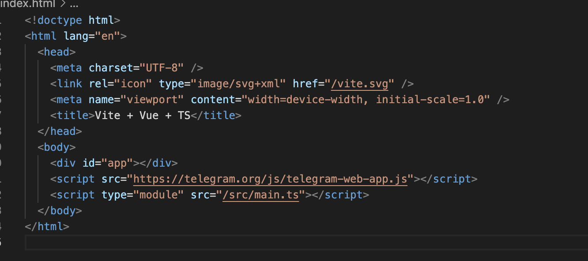
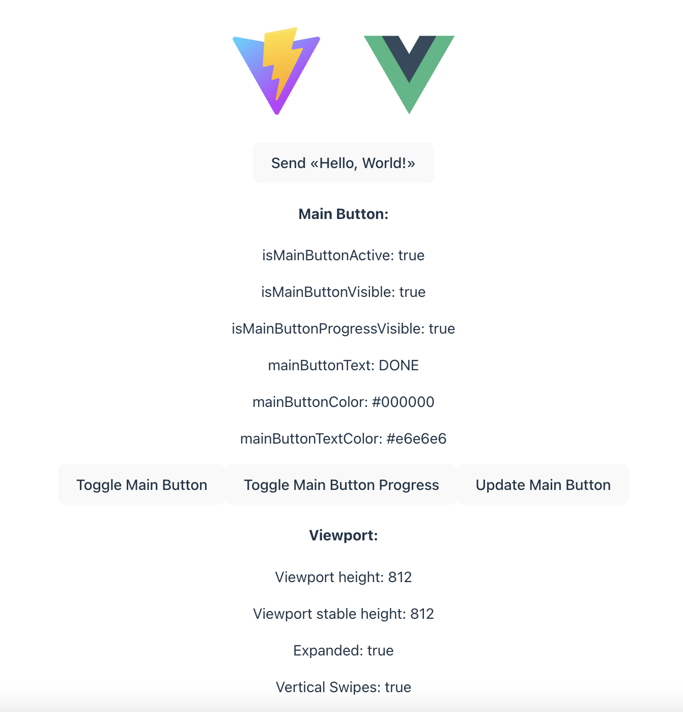
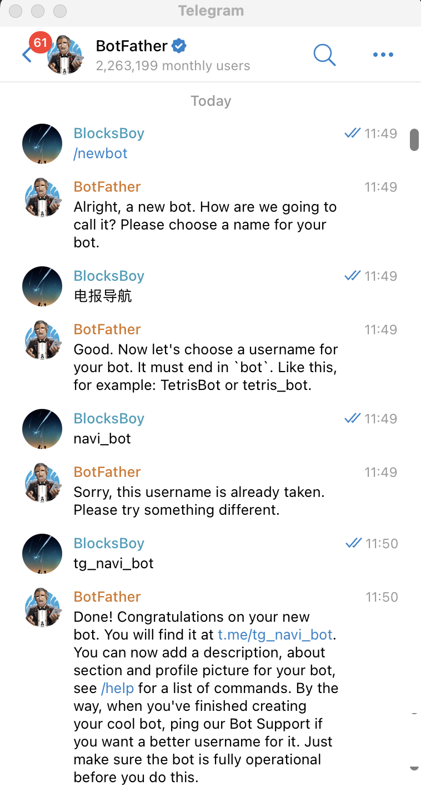
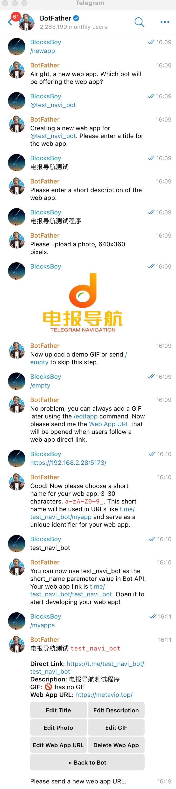
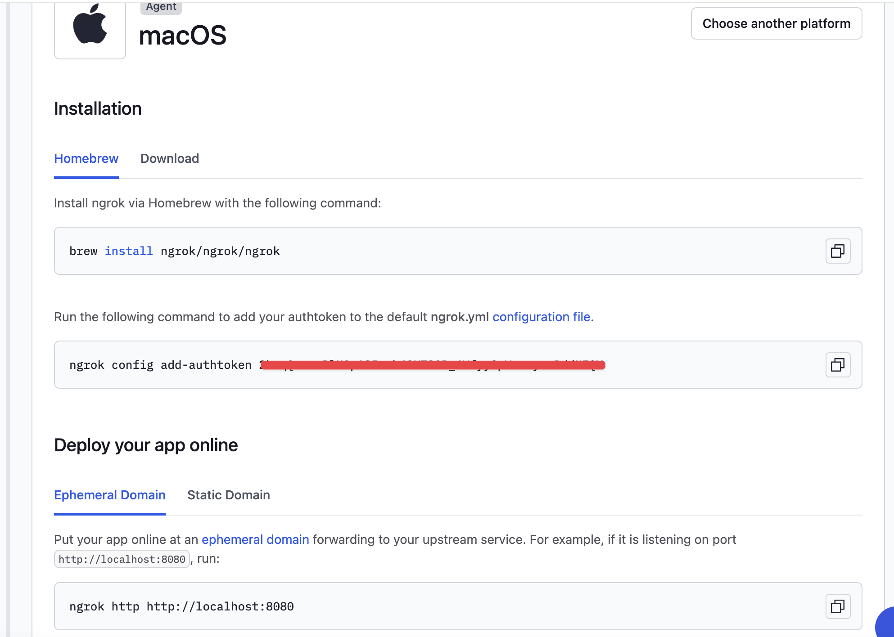
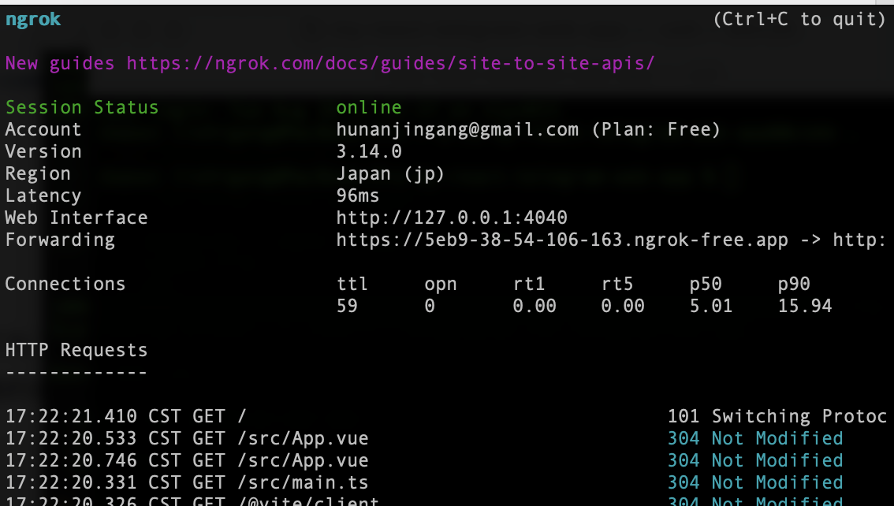
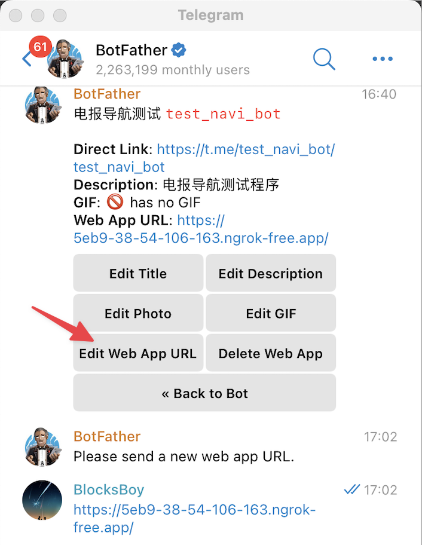
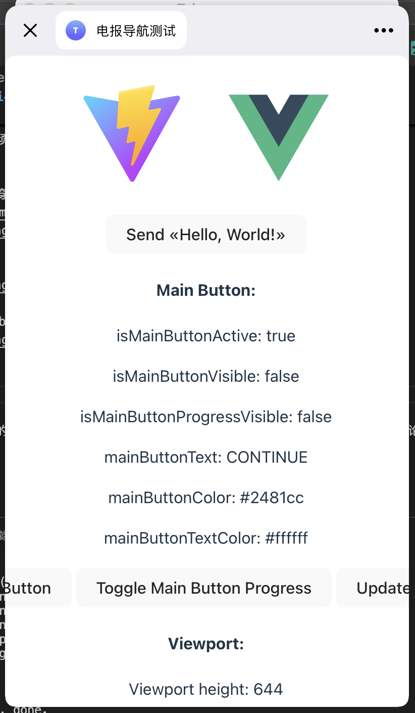

# 电报小程序(telegram-mini-app)开发实践

### 前言
Telegram Mini Apps（TMA）是在 Telegram 消息传递应用程序内运行的 Web 应用程序。它们是使用 Web 技术构建的 —— HTML、CSS 和 JavaScript。Telegram Mini Apps 可用于创建 DApps、游戏以及其他可以在 Telegram 内运行的应用程序类型。

2022年4月Telegram的MiniApp（之前为Web App，6.0版后改名为Mini App）上线，Mini Apps（简称 TMAs，中文名：小程序）很可能会变成一个类似于微信小程序的平台，使得Telegram 更接近一个“超级应用”。目前，电报小程序推出不久，版本还在快速迭代中，开发人员也较少，但电报庞大的用户群基础很可能会产生大量的小程序。


### 1、Vite+React+Typescript 开发电报小程序
直接运行以下命令创建带有 TypeScript 支持的 React 项目：

使用npm
```
# npm 7+, extra double-dash is needed:
npm create vite my-react-telegram-mini-app -- --template react-ts
```
使用yarn
```
# or yarn
yarn create vite my-react-telegram-mini-app --template react-ts
```

进入项目工程
```
# this will change the directory to recently created project
 cd my-react-telegram-mini-app&&code .
```

开始项目的开发模式，在终端运行以下命令：

使用npm
```
# npm
npm install
npm run dev --host
```
使用yarn
```
# or yarn
yarn
yarn dev --host
```

添加 @twa-dev/sdk 到工程中

使用npm
``` 
npm install @twa-dev/sdk
```
使用yarn
```
yarn add @twa-dev/sdk
```

打开 /src/main.tsx 文件并添加以下内容：
```
import WebApp from '@twa-dev/sdk'

WebApp.ready();
``` 

WebApp.ready() - 是一个方法，向 Telegram 应用程序通知小程序已准备好显示。建议尽可能早地调用此方法，一旦加载了所有必要的接口元素。一旦调用此方法，加载的占位符将被隐藏，小程序将被显示。

添加小程序元素与用户交互。进入 src/App.tsx，这里我们添加带有弹框的按钮。
```
import { useState } from 'react'
import reactLogo from './assets/react.svg'
import viteLogo from '/vite.svg'
import './App.css'

import WebApp from '@twa-dev/sdk'

function App() {
  const [count, setCount] = useState(0)

  return (
    <>
      <div>
        <a href="https://vitejs.dev" target="_blank">
          
        </a>
        <a href="https://react.dev" target="_blank">
          
        </a>
      </div>
      <h1>Vite + React</h1>
      <div className="card">
        <button onClick={() => setCount((count) => count + 1)}>
          count is {count}
        </button>
      </div>
        {/* Here we add our button with alert callback */}
      <div className="card">
        <button onClick={() => WebApp.showAlert(`Hello World! Current count is ${count}`)}>
            Show Alert
        </button>
      </div>
    </>
  )
}

export default App
```
效果如图：


### 2、Vite+Vue+Typescript 开发电报小程序
直接运行以下命令创建带有 TypeScript 支持的 Vue 项目：
使用npm
```
# npm 7+, extra double-dash is needed:
npm create vite my-vue-telegram-mini-app -- --template vue-ts
```
使用yarn
```
# or yarn
yarn create vite my-vue-telegram-mini-app --template vue-ts
```

进入项目工程
```
# this will change the directory to recently created project
 cd my-vue-telegram-mini-app&&code .
```

开始项目的开发模式，在终端运行以下命令：

使用npm
```
# npm
npm install
npm run dev --host
```
使用yarn
```
# or yarn
yarn
yarn dev --host
```

在 index.html 中添加引用
```
<script src="https://telegram.org/js/telegram-web-app.js"></script>
```
如图：



在/src/components/HelloWorld.vue中添加组件使用代码：
```
<script lang="ts" setup>
import {
  useWebApp,
  useWebAppHapticFeedback,
  useWebAppMainButton,
  useWebAppNavigation,
  useWebAppPopup,
  useWebAppQrScanner,
  useWebAppTheme,
  useWebAppViewport,
  useWebAppBiometricManager,
} from 'vue-tg'

const { version, platform, initData, initDataUnsafe, sendData } = useWebApp()
const { expand, isExpanded, viewportHeight, viewportStableHeight, isVerticalSwipesEnabled } = useWebAppViewport()
const { openLink, openTelegramLink, switchInlineQuery } = useWebAppNavigation()
const { showConfirm, showAlert, showPopup } = useWebAppPopup()
const {
  showMainButton,
  hideMainButton,
  showMainButtonProgress,
  hideMainButtonProgress,
  mainButtonText,
  mainButtonColor,
  mainButtonTextColor,
  isMainButtonActive,
  isMainButtonVisible,
  isMainButtonProgressVisible,
  setMainButtonParams,
} = useWebAppMainButton()
const { colorScheme, themeParams, headerColor, backgroundColor } = useWebAppTheme()
const { impactOccurred, notificationOccurred, selectionChanged } = useWebAppHapticFeedback()
const { showScanQrPopup } = useWebAppQrScanner()
const {
  isBiometricInited,
  isBiometricAccessRequested,
  isBiometricAccessGranted,
  isBiometricTokenSaved,
  isBiometricAvailable,
  biometricDeviceId,
  initBiometric,
  requestBiometricAccess,
  authenticateBiometric,
  openBiometricSettings,
} = useWebAppBiometricManager()

function toggleMainButton() {
  isMainButtonVisible.value
    ? hideMainButton()
    : showMainButton()
}

function toggleMainButtonProgress() {
  isMainButtonProgressVisible.value
    ? hideMainButtonProgress()
    : showMainButtonProgress(true)
}

function initBiometricManager() {
  initBiometric(() => console.log('init: isAccessGranted'))
}

function requestAccessBiometricManager() {
  requestBiometricAccess({})
}

function authenticateBiometricManager() {
  authenticateBiometric({}, (isAuthenticated) => {
    showAlert(`isAuthenticated: ${isAuthenticated}`)
  })
}

function openSettingsBiometricManager() {
  openBiometricSettings()
}
</script>

<template>
  <section>
    <tg-main-button disabled />
    <button @click.prevent="sendData('Hello, World!')">
      Send «Hello, World!»
    </button>
  </section>

  <section>
    <div>
      <h4>Main Button:</h4>
      <p>
        isMainButtonActive: {{ isMainButtonActive }}
      </p>
      <p>
        isMainButtonVisible: {{ isMainButtonVisible }}
      </p>
      <p>
        isMainButtonProgressVisible: {{ isMainButtonProgressVisible }}
      </p>
      <p>
        mainButtonText: {{ mainButtonText }}
      </p>
      <p>
        mainButtonColor: {{ mainButtonColor }}
      </p>
      <p>
        mainButtonTextColor: {{ mainButtonTextColor }}
      </p>

      <button @click.prevent="toggleMainButton">
        Toggle Main Button
      </button>
      <button @click.prevent="toggleMainButtonProgress">
        Toggle Main Button Progress
      </button>
      <button
        @click.prevent="setMainButtonParams({
          text: 'DONE',
          color: '#000',
          text_color: '#e6e6e6',
        })"
      >
        Update Main Button
      </button>
    </div>

    <div>
      <h4>Viewport:</h4>
      <p>
        Viewport height: {{ viewportHeight }}
      </p>
      <p>
        Viewport stable height: {{ viewportStableHeight }}
      </p>
      <p>
        Expanded: {{ isExpanded }}
      </p>
      <p>
        Vertical Swipes: {{ isVerticalSwipesEnabled }}
      </p>

      <button @click.prevent="expand()">
        Expand Viewport
      </button>
      <button @click.prevent="isVerticalSwipesEnabled = !isVerticalSwipesEnabled">
        Toggle Vertical Swipes
      </button>
    </div>

    <div>
      <h4>Navigation:</h4>
      <ul>
        <li>
          <a href="?nextpage=1">Regular link</a> (opens inside webview)
        </li>
        <li>
          <a
            href="https://telegram.org/" target="_blank"
          >target="_blank" link</a> (opens outside webview)
        </li>
        <li>
          <a
            href="javascript:window.open('https://telegram.org/');"
          >window.open() link</a> (opens outside webview)
        </li>
        <li>
          <a
            href="https://t.me/like"
          >LikeBot t.me link</a> (opens inside Telegram app)
        </li>
        <li>
          <a
            href="#"
            @click.prevent="openTelegramLink('https://t.me/vote');"
          >openTelegramLink()</a> (opens
          inside Telegram app)
        </li>
        <li>
          <a
            href="#" @click.prevent=" openLink('https://google.com/'); "
          >openLink()</a> (opens outside
          webview)
        </li>
        <li>
          <a
            href="#"
            @click.prevent=" openLink('https://telegra.ph/api', { try_instant_view: true }); "
          >openLink({try_instant_view:true})</a>
          (opens IV inside Telegram app)
        </li>
        <li>
          <a
            href="#"
            @click.prevent=" switchInlineQuery('query'); "
          >switchInlineQuery('query')</a>
          (opens inline query inside Telegram app)
        </li>
      </ul>
    </div>

    <div>
      <h4>Popups:</h4>
      <ul>
        <li>
          <a
            href="#" @click.prevent="showAlert('Hello!');"
          >showAlert</a>
        </li>
        <li>
          <a
            href="#" @click.prevent="showConfirm('Are you sure?');"
          >showConfirm</a>
        </li>
        <li>
          <a
            href="#"
            @click.prevent="showPopup({
              message: 'Hello!',
            });"
          >showPopup</a>
        </li>
        <li>
          <a
            href="#"
            @click.prevent="showScanQrPopup({
              text: 'Test',
            })"
          >showScanQrPopup</a>
        </li>
      </ul>
    </div>

    <div>
      <h4>Haptics:</h4>
      <ul>
        <li>
          Impact: <a
            href="#"
            @click.prevent="impactOccurred('heavy');"
          >heavy</a>, &nbsp; <a
            href="#"
            @click.prevent="impactOccurred('light');"
          >light</a>, &nbsp; <a
            href="#"
            @click.prevent="impactOccurred('medium');"
          >medium</a>, &nbsp; <a
            href="#"
            @click.prevent="impactOccurred('rigid');"
          >rigid</a>, &nbsp; <a
            href="#"
            @click.prevent="impactOccurred('soft');"
          >soft</a><br><br>
        </li>
        <li>
          Notification: <a
            href="#" @click.prevent="notificationOccurred('error');"
          >error</a>,
          &nbsp; <a
            href="#" @click.prevent="notificationOccurred('success');"
          >success</a>, &nbsp; <a
            href="#"
            @click.prevent="notificationOccurred('warning');"
          >warning</a><br><br>
        </li>
        <li>
          Selection: <a
            href="#" @click.prevent="selectionChanged();"
          >changed</a><br><br>
        </li>
      </ul>
    </div>

    <div>
      <h4>Data passed</h4>
      <h5>initData</h5>
      <pre><code>{{ initData }}</code></pre>
      <h5>initDataUnsafe</h5>
      <pre><code>{{ initDataUnsafe }}</code></pre>
    </div>

    <div>
      <h4>Theme params</h4>
      <div class="sect_row">
        Color scheme: {{ colorScheme }}
      </div>
      <div class="sect_row">
        Header:
        <select disabled>
          <option :selected="headerColor === themeParams.bg_color ">
            bg_color ({{ headerColor }})
          </option>
          <option :selected="headerColor === themeParams.secondary_bg_color ">
            secondary_bg_color ({{ headerColor }})
          </option>
        </select>
      </div>
      <div class="sect_row">
        Background:
        <select disabled>
          <option :selected="backgroundColor === themeParams.bg_color ">
            bg_color ({{ backgroundColor }})
          </option>
          <option :selected="backgroundColor === themeParams.secondary_bg_color ">
            secondary_bg_color ({{ backgroundColor }})
          </option>
        </select>
      </div>

      <pre><code>{{ themeParams }}</code></pre>
    </div>

    <div>
      <h4>Biometric Manager</h4>
      <p>isBiometricInited: {{ isBiometricInited }}</p>
      <p>isBiometricAccessRequested: {{ isBiometricAccessRequested }}</p>
      <p>isBiometricAccessGranted: {{ isBiometricAccessGranted }}</p>
      <p>isBiometricTokenSaved: {{ isBiometricTokenSaved }}</p>
      <p>isBiometricAvailable: {{ isBiometricAvailable }}</p>
      <p>biometricDeviceId: {{ biometricDeviceId }}</p>

      <button @click.prevent="initBiometricManager">Init</button>
      <button @click.prevent="requestAccessBiometricManager">
        request access
      </button>
      <button @click.prevent="authenticateBiometricManager">
        authenticate
      </button>
      <button @click.prevent="openSettingsBiometricManager">
        open settings
      </button>
    </div>

    <div>
      Version: {{ version }}
      <br>
      Platform: {{ platform }}
    </div>
  </section>
</template>

<style>
body {
  background-color: white;
}
</style>
```
运行效果：



### 3、创建并配置小程序
打开 Telegram 应用程序或网页版本。
在搜索栏中搜索 @BotFather 或打开链接 https://t.me/BotFather。
通过点击 START 按钮来开始与 BotFather 的对话执行创建以及配置步骤。

1、创建Bot，Bot与App是一对多的关系，一个Bot可以创建多个App 如下图：



2、创建App，这里需要提供一张640x360尺寸的Logo图片，如下图：



需要注意的是，现在小程序中必须使用https协议才能部署运行。

### 4、本地调试小程序
使用以下工具来Debug小程序：

#### Android
在您的设备上启用USB调试。
在Telegram设置中，向下滚动，按住版本号两次。
在调试设置中选择启用WebView调试。
将手机连接到计算机，并在Chrome中打开chrome://inspect/#devices - 当您在手机上启动小程序时，您会在那里看到它。

#### Windows和Linux上的Telegram桌面版
下载并启动[Telegram桌面版的Beta版本](https://desktop.telegram.org/changelog#beta-version)。
转到设置 > 高级 > 实验设置 > 启用WebView检查。
右键单击WebView并选择检查元素。

#### macOS上的Telegram
下载并启动[Telegram macOS的Beta版本](https://install.appcenter.ms/users/keepcoder/apps/Telergam-Beta-Updated/distribution_groups/public)
快速点击5次设置图标以打开调试菜单，并启用调试Web App。
右键单击小程序并选择检查元素。

#### iOS上的Telegram
下载最新的App，然后安装如上步骤进行配置操作即可。

然后这里我们需要使用ngrok做内网穿透，将本地程序端口映射到外网。这样做的目的仅是为了给本地端口号使用https协议的网址。

进入官网 https://ngrok.com/ 注册账号，然后安装步骤安装即可。



映射端口：



然后进入电报修改之前绑定的Web App URL, 如下图：



最终运行效果图：



至此我们从小程序代码创建到本地调试的操作步骤就基本跑通了，让我们开启电报小程序的开发之旅吧！有问题欢迎讨论交流。
